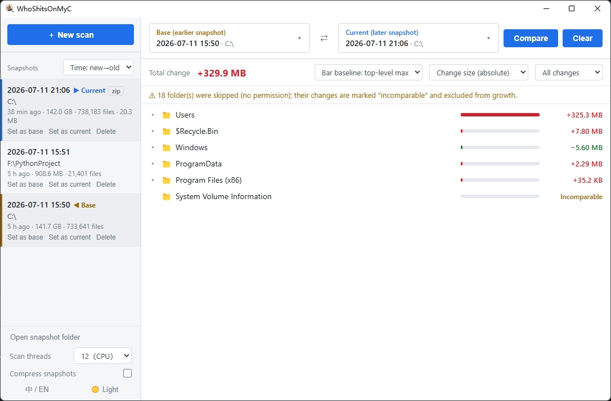

# WhoShitsOnMyC

[English](README.md) | [中文](README.zh-CN.md)

<div align="center">
  
  <h1>WhoShitsOnMyC</h1>
  <p><strong>Cleaned C: and free space vanished again days later? Record it, then find out what ate the space</strong></p>
</div>


<p align="center">
  <a href="https://github.com/Kami958/WhoShitsonMyC/releases"></a>
  <a href="https://github.com/Kami958/WhoShitsonMyC/blob/master/LICENSE"></a>
  
  
</p>

---

## Why this exists

You clean the C drive with a cleanup tool and things stay quiet for a while. Then one day a large chunk of space is gone, and you have no idea where the new junk came from. Open the cleanup tool again and you still get a list of “maybe deletable” items — more guessing. **You never know who snuck back and took a dump after last time**

**WhoShitsOnMyC** is built for exactly that

> **Compared with last time, what changed?**

Instead of hunting junk by feel every time, scan once while space still looks fine and keep a baseline. When space is eaten again, scan the same place once more. Side by side, you can see what grew and what newly showed up

<p align="center">
  
</p>

## Features

- **Time-based comparison**: earlier snapshot as **Base**, later as **Current** — see how space changed over that period
- **Expandable change tree**: expand only the levels you care about; no need to open the whole tree at once, so large directories stay smooth
- **Easy colors**: red = grew / added, green = shrank / removed, amber = no permission / incomparable
- **Sort and filter**: by delta, percent change, name, or modification time; show only growth or only shrink
- **Multi-threaded scan**: scan multiple folders in parallel; prefer 1 thread on HDDs, raise it on SSDs for speed
- **Optional snapshot compression**: save as `.dbz` to use less disk; decompress when comparing
- **Single executable**: one `.exe`, no background service, no registry writes
- **Chinese / English UI, dark / light theme**: follows system language by default; switch anytime
- **Explorer integration**: right-click a row to open it in File Explorer or copy the full path

## Download

Get `WhoShitsOnMyC.exe` from [Releases](https://github.com/Kami958/WhoShitsonMyC/releases)

| Item | Detail |
| --- | --- |
| OS | Windows 10 / 11 |
| WebView2 | The UI needs [Microsoft Edge WebView2](https://developer.microsoft.com/microsoft-edge/webview2/). Windows 11 and most Windows 10 installs already have it. If missing, the app prompts you and opens the download page — install the Evergreen package once, then reopen the app |

## Quick start

**Run as Administrator when you can.** Scanning system folders like `C:\Windows` hits far fewer permission walls that way

1. After a cleanup, or while space still looks fine, click **＋ New scan**, pick a folder (for example `C:\`), and keep a baseline
2. When space is eaten again, scan the **same** folder once more
3. Set the earlier one as **Base**, the later as **Current**, then click **Compare**
4. Expand the change tree and follow the red / green markers to what grew
5. Right-click a row to open it in File Explorer, or copy the full path

Sidebar options:

- **Scan threads**: how many workers scan the disk in parallel. Prefer 1 on HDDs; raise it on SSDs for speed
- **Compress snapshots**: save finished scans as `.dbz` to use less disk; decompress when comparing
- **Language / theme**: Chinese or English; dark or light

> Both snapshots must cover the same folder. Two scans of `C:\` can be compared; `C:\` against `D:\` cannot

## Data & uninstall

> Yes, we also left a bit of 💩~ under your C drive

| Content | Location |
| --- | --- |
| Snapshots (`.db` / `.dbz`) | `%LOCALAPPDATA%\WhoShitsOnMyC\snapshots\` |
| Decompress cache | `%LOCALAPPDATA%\WhoShitsOnMyC\cache\` |

If you want the history gone too, delete the data folder first, then the `.exe`

Paste this into File Explorer’s address bar to open the data folder:

```text
%LOCALAPPDATA%\WhoShitsOnMyC
```

Or delete it with PowerShell:

```powershell
Remove-Item -Recurse -Force "$env:LOCALAPPDATA\WhoShitsOnMyC" -ErrorAction SilentlyContinue
```

## FAQ

**Why can the scanned total exceed “This PC” used space?**  
Places like `C:\Windows\WinSxS` have many hard links, so the same file can be counted more than once. Sizes here are logical, not cluster-aligned physical usage. The **delta between two scans of the same folder** is still solid for finding what grew

**Can two different folders be compared?**  
No. Both sides must be the same folder

**What does “Incomparable” mean?**  
One side had no permission or a read error, so data is incomplete. The app will not invent a size change

**The app says WebView2 is missing.**  
Install the [WebView2 Evergreen package](https://developer.microsoft.com/microsoft-edge/webview2/) once, then reopen the app

**Are settings saved?**  
No — they are gone when you close the app. Only snapshots stay in the data folder above

---

## Build from source

For developers

Requires **Python 3.10+**

```bash
pip install -r requirements.txt
python app.py
python -m pytest tests/ -q

pip install pyinstaller
python build.py   # → dist/WhoShitsOnMyC.exe
```

`requirements.txt` covers runtime and tests. Install PyInstaller only when you need the `.exe`

## Project layout

```text
app.py              Window + bridge (pywebview, JS API, WebView2 check)
build.py            Packaging script
core/               Core logic (no UI)
  models.py           Data models and change kinds
  scanner.py          Multi-threaded scan
  snapshot.py         SQLite snapshot I/O
  differ.py           Layer-by-layer compare
  compress.py         .db ↔ .dbz
  store.py            Snapshot storage and session settings
  i18n.py             Backend message language
web/                Frontend HTML / CSS / JS
tests/              Unit tests
assets/screenshots/ UI screenshots
```

## License

[MIT](LICENSE)
