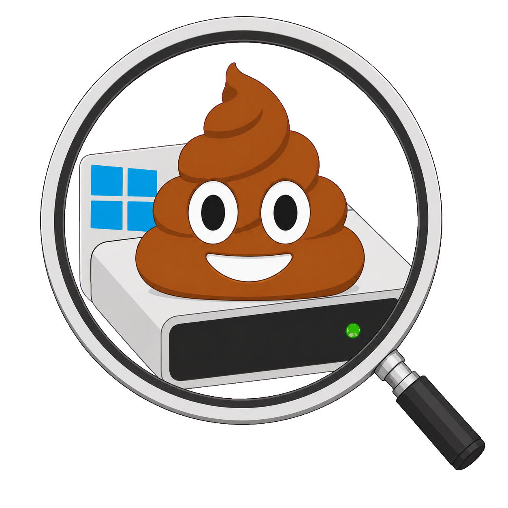
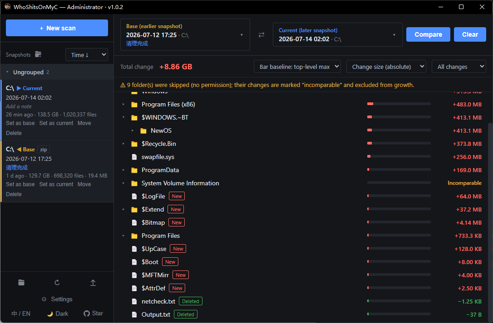

# WhoShitsOnMyC

[English](README.md) | [中文](README.zh-CN.md)

<div align="center">
  
  <h1>WhoShitsOnMyC</h1>
  <p><strong>Just cleaned your C: drive — and free space mysteriously vanished again a few days later? Take a snapshot, then find out what ate the space</strong></p>
</div>


<p align="center">
  <a href="https://github.com/Kami958/WhoShitsonMyC/releases"></a>
  <a href="https://github.com/Kami958/WhoShitsonMyC/blob/master/LICENSE"></a>
  
  
</p>

---

## Why this exists

You clean up C: with a disk cleaner and everything stays fine for a while. Then one day a huge chunk of free space is gone, and you have no idea where the new junk came from. Open the cleaner again and it’s still the same “maybe safe to delete” list — more guessing. **You never know who snuck back and took a dump after the last cleanup**

**WhoShitsOnMyC** is built for that exact problem

> **Compared with last time, what changed?**

Instead of hunting junk by gut feeling every time, scan once while space still looks normal to get an older snapshot, then scan again after usage grows to get a newer one.
**Compare the snapshots and you can see at a glance what grew and what showed up new**

<p align="center">
  
</p>

## Download

Grab a build from [Releases](https://github.com/Kami958/WhoShitsonMyC/releases)

| Requirement | Notes |
| --- | --- |
| OS | Windows 10 / 11 |
| WebView2 | The UI needs [Microsoft Edge WebView2](https://developer.microsoft.com/microsoft-edge/webview2/). **Windows 11 and most Windows 10 PCs already have it.** If it’s missing, the app will tell you and open the download page — install the Evergreen runtime, then start the app again |

## Quick start (recommended: run as administrator)


1. **Run as administrator** — faster drive-root scans, and some hidden paths become readable
2. Click **＋ New scan**, pick a folder such as `C:\`. When the scan finishes, you get a snapshot
3. When free space is eaten again, scan the **same** folder once more
4. Set the older snapshot as **Base**, the newer one as **Current**, then click **Compare**
5. Results show up below: red means growth, green means shrink

At the bottom of the sidebar you can also:

- **Open / refresh / import snapshots**: open the current snapshot folder, refresh the list, or import snapshots from elsewhere
- **Settings**: adjust scan threads, snapshot compression, MFT attempt, snapshot folder, and more
- **Language / theme**: switch between Chinese and English, dark and light

## Data & uninstall

### What data files we leave behind

> Yes — we left a little 💩 on your C: drive too

Config files and default snapshots created by the app live here by default:

`%LOCALAPPDATA%\WhoShitsOnMyC`

Paste that path into File Explorer’s address bar and press Enter to open it

| What | Where |
| --- | --- |
| Snapshots | By default in the `snapshots` folder under the path above; you can change this to another location in Settings |
| Settings | Stored as a config file in the same folder; saved after you change options and click **Done** |

### How to uninstall WhoShitsOnMyC?

**Open Settings → General, click the red Uninstall, then confirm in the dialog whether to delete data and finish cleanup**

- When data deletion is on, the app clears config and snapshots under the default data folder
- **If you migrated the snapshot folder, that migrated location still needs to be deleted manually!**
- After cleanup, delete the exe yourself

## FAQ

**Q: Why does scanning take so long?**  
**A: Scan time mainly depends on how many files sit under the path you chose, and on your machine**

> Ballpark: volume-root scan of ~1M files on an M.2 SSD with MFT on is often around the low-teens of seconds (machine and cold/warm cache vary)

- If the scan path is on a hard disk drive, set the scan thread count to **1** in Settings

- **When scanning a drive root** (e.g. `C:\`, `D:\`), turning **Try MFT scan** on or off in Settings may help (administrator required)
- Still stuck? Open an issue

**Q: Why do two scans in a row show a large size difference?**

**A:** Common cases:

1. The two scans ran under different elevation modes (**non-admin vs admin**); some paths need administrator rights to read
2. Other software really wrote data between the two scans — check the compare tree for details

**Q: Why does the compare tree show “Incomparable”?**  
**A:** Some paths may not have been scanned fully — often because of permissions — so they cannot take part in the compare

**Q: The app says WebView2 is missing**  
**A:** Install the [WebView2 Evergreen runtime](https://developer.microsoft.com/microsoft-edge/webview2/), then start the app again


---

## Build from source

Requires **Python 3.10+**

```bash
pip install -r requirements.txt
python app.py
python -m pytest tests/ -q

pip install pyinstaller
python build.py
```

## Developers

For project layout and internals, see the [developer docs](assets/docs/Designed.md)

## License

[MIT](LICENSE)

## Links

[LINUX DO](https://linux.do/)
