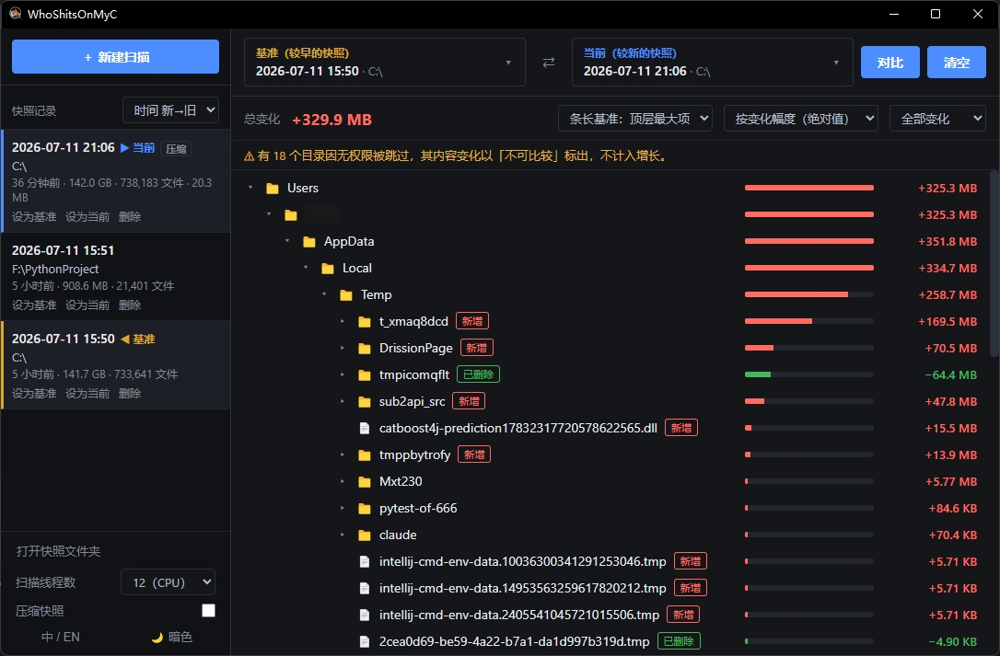

# WhoShitsOnMyC

[English](README.md) | [中文](README.zh-CN.md)

<div align="center">
  
  <h1>WhoShitsOnMyC</h1>
  <p><strong>C 盘刚清完，过几天又莫名少了一大截？用它记录找出这段时间到底是谁在吃空间</strong></p>
</div>


<p align="center">
  <a href="https://github.com/Kami958/WhoShitsonMyC/releases"></a>
  <a href="https://github.com/Kami958/WhoShitsonMyC/blob/master/LICENSE"></a>
  
  
</p>

---

## 它解决什么问题

用清理软件清完 C 盘，通常能安静一阵子。可某天空间突然少了一大截，新垃圾从哪来却完全没头绪。再打开清理软件，还是一堆「也许能删」的项目，只能继续瞎猜，**你永远不知道是谁在上次过后偷偷拉💩**

**WhoShitsOnMyC** 正是为此而生

> **和上次比，谁变了？**

与其每次都靠感觉找垃圾，不如在空间还正常时先扫一遍留个底，等又被吃掉后再扫一遍。两相对比，谁在涨、谁新冒出来，一眼就能看出来

<p align="center">
  
</p>

## 功能特点

- **按时间对比**：较早的快照作「基准」，较新的作「当前」，看这段时间空间是怎么变的
- **可展开的变化树**：想看哪层点哪层，不用一次摊开整棵树，目录再大也不容易卡
- **颜色好认**：红 = 变大 / 新增，绿 = 变小 / 删除，琥珀 = 权限不够、比不了
- **排序和筛选**：按变化量、变化比例、名称、修改时间排，也能只看变大或只看变小
- **多线程扫描**：同时扫多个目录；机械硬盘建议 1 线程，SSD 开高一点更快
- **可选压缩快照**：扫完可压成 `.dbz` 少占磁盘，对比时再解压
- **单文件运行**：一个 exe 直接跑，没有后台服务，也不写注册表
- **中英文界面，暗色 / 浅色主题**：默认跟系统语言，随时能改
- **资源管理器定位**：右键某一项，可以在资源管理器里打开，也可以复制完整路径

## 下载

到 [Releases](https://github.com/Kami958/WhoShitsonMyC/releases) 下载 `WhoShitsOnMyC-v*.exe`

| 项目 | 说明 |
| --- | --- |
| 系统 | Windows 10 / 11 |
| WebView2 | 界面需要 [Microsoft Edge WebView2](https://developer.microsoft.com/microsoft-edge/webview2/)。Windows 11 和多数 Windows 10 一般已经有了；没有的话，启动时会提示并打开下载页，装好常青版再打开程序 |

## 快速上手

**建议用管理员身份运行**。扫 `C:\Windows` 这类系统目录时，被权限挡住的目录会少很多

1. 刚清理完，或空间看着还正常时，点 **＋ 新建扫描**，选一个目录（比如 `C:\`），先留一份基准
2. 空间又被吃掉时，对**同一个目录**再扫一次
3. 较早的那份设为 **基准**，较新的设为 **当前**，点 **对比**
4. 在变化树里往下展开，顺着红绿标记找是谁变大了
5. 右键某一行，可以打开资源管理器，也可以复制完整路径

侧栏还可以调：

- **扫描线程数**：同时跑多少线程去扫盘。机械硬盘建议 1，SSD 可以开高一点，扫得更快
- **压缩快照**：扫完后压成 `.dbz`，少占磁盘；对比时再解压
- **语言 / 主题**：中文或英文，暗色或浅色

> 两份快照必须扫的是同一个目录。两次都是 `C:\` 可以比；一次 `C:\`、一次 `D:\` 不行

## 数据与卸载

> 是的，我们也在你的 C 盘底下拉了一点 💩~

| 内容 | 位置 |
| --- | --- |
| 快照（`.db` / `.dbz`） | `%LOCALAPPDATA%\WhoShitsOnMyC\snapshots\` |
| 解压缓存 | `%LOCALAPPDATA%\WhoShitsOnMyC\cache\` |

历史快照也不要了，先删数据目录，再删 exe 就行

数据目录可以在资源管理器地址栏粘贴打开：

```text
%LOCALAPPDATA%\WhoShitsOnMyC
```

也可以用 PowerShell 删：

```powershell
Remove-Item -Recurse -Force "$env:LOCALAPPDATA\WhoShitsOnMyC" -ErrorAction SilentlyContinue
```

## 常见问题

**扫出来的总量为什么可能比「此电脑」里的已用空间还大？**  
像 `C:\Windows\WinSxS` 这类地方有很多硬链接，同一个文件可能被算好几次；而且这里是逻辑大小，不是按簇算的物理占用。不过同一目录两次扫描之间的**差值**仍然靠谱，用来找谁在涨空间没问题

**能不能对比两个不同的目录？**  
不能，两边必须是同一个目录

**「不可比较」是什么意思？**  
某一侧没权限或读出错，数据不全，程序不会瞎编一个变化量

**启动时提示缺少 WebView2？**  
装一次 [WebView2 常青版](https://developer.microsoft.com/microsoft-edge/webview2/)，再打开程序

**设置会保存吗？**  
不会，关掉就没了。只有快照会留在上面的数据目录里

---

## 从源码构建

下面写给开发者

需要 **Python 3.10+**

```bash
pip install -r requirements.txt
python app.py
python -m pytest tests/ -q

pip install pyinstaller
python build.py   # → dist/WhoShitsOnMyC-v{version}.exe
```

`requirements.txt` 里是运行和测试用的依赖。只有要打 exe 时才需要装 PyInstaller

## 项目结构

```text
app.py              窗口与前后端桥接（pywebview、JS API、WebView2 检测）
build.py            打包脚本
core/               核心逻辑（不依赖界面）
  models.py           数据结构和变化类型
  scanner.py          多线程扫描
  snapshot.py         SQLite 快照读写
  differ.py           逐层对比
  compress.py         .db ↔ .dbz
  store.py            快照存放位置和临时设置
  i18n.py             后端提示语言
web/                前端 HTML / CSS / JS
tests/              单元测试
assets/screenshots/ 界面截图
```

## 许可

[MIT](LICENSE)
